```sql
harsh=# SELECT * FROM engineers WHERE github = 'Harsh-Vaghela-404';
-[ RECORD 1 ]-----------------------------------------------
name     | Harsh Vaghela
role     | Backend engineer
stack    | Node.js, TypeScript, PostgreSQL
building | Duraflow: durable workflow engine for AI agents
contact  | harsh.vaghela.work@gmail.com

Time: 0.042 ms
```

<p>
  <a href="https://www.linkedin.com/in/harsh-vaghela-169059201/"></a>
  <a href="https://medium.com/@harsh.vaghela.work"></a>
  <a href="https://leetcode.com/u/harshVaghela01/"></a>
  <a href="https://www.hackerrank.com/profile/harsh_vaghela_w1"></a>
</p>

**Now:** <!--CURRENT-START-->postgres connection pooling: why a new connection forks a whole backend process, and how pgbouncer's transaction mode trades away prepared statements and session state for reuse<!--CURRENT-END-->

#### Duraflow

Durable workflow engine for AI agents. Wrap agent steps in `step.run()` and get
Postgres-backed checkpointing, crash resume, automatic saga rollback, and a
dead-letter queue for failed compensations.

[Code](https://github.com/Harsh-Vaghela-404/duraflow) · [Docs](https://duraflow-docs.vercel.app)

#### Writing

<!-- BLOG-POST-LIST:START -->
- [Queue Depth Lies. Watch Event Loop Lag Instead.](https://levelup.gitconnected.com/queue-depth-lies-watch-event-loop-lag-instead-d340835b45c9?source=rss-aad24d9e7285------2)
- [How I Built a Custom IPC Protocol Inside Node.js Worker Threads](https://levelup.gitconnected.com/how-i-built-a-custom-ipc-protocol-inside-node-js-worker-threads-4db648f21ee8?source=rss-aad24d9e7285------2)
- [Postgres is the only Queue you need &lpar;until 50k jobs/sec&rpar;](https://medium.com/@harsh.vaghela.work/postgres-is-the-only-queue-you-need-until-50k-jobs-sec-5931611b551c?source=rss-aad24d9e7285------2)
- [✨ CI/CD with GitHub Actions — Part 3: Security, Observability &amp; Production-Grade Pipeline Patterns](https://medium.com/@harsh.vaghela.work/ci-cd-with-github-actions-part-3-security-observability-production-grade-pipeline-patterns-c89db981d2ad?source=rss-aad24d9e7285------2)
<!-- BLOG-POST-LIST:END -->

More on [Medium](https://medium.com/@harsh.vaghela.work).

#### Stack

|  |  |
| --- | --- |
| **Core** |     |
| **Data** |      |
| **Infra** |        |

#### Stats

<p align="center">
  
</p>
<p align="center">
  <picture>
    <source media="(prefers-color-scheme: dark)" srcset="https://leetcard.jacoblin.cool/harshVaghela01?theme=dark&ext=heatmap">
    
  </picture>
</p>
